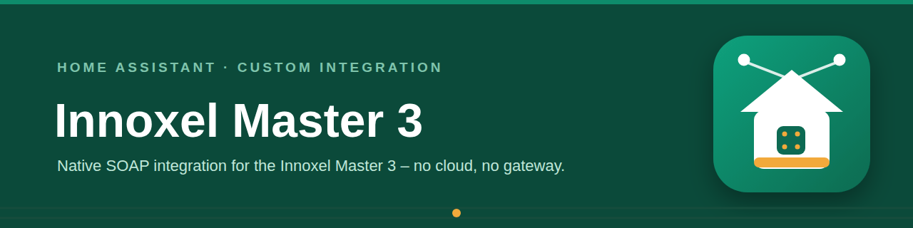

# Innoxel Master 3 — Home Assistant Integration

A native Home Assistant custom integration for the **Innoxel Master 3** home automation controller, talking directly to its SOAP API — no cloud, no MQTT bridge, no separate gateway.

> This is an independent, community-built integration. It is **not affiliated with or endorsed by Innoxel**, and does not use any Innoxel trademarks or branding.

## Why this exists

The Innoxel Master 3 only exposes a SOAP interface and has no official Home Assistant integration. This project talks to that SOAP API directly and maps your configured modules (covers, switches, dimmers, sensors, room climate, time switches) to native Home Assistant entities — automatically, based on how you've already named and described things in your Innoxel configuration. No YAML mapping, no manual entity setup.

Protocol details were informed by the community reference project [matthsc/innoxel-soap](https://github.com/matthsc/innoxel-soap) — credit to its author for documenting the SOAP interface.

## What it provides

| Platform | Source | Notes |
|---|---|---|
| `cover` | `masterOutModule` with `"Motor"` in the description | Full-travel movement via matching virtual `masterInModule` channel (`autoImpulse`) when found; otherwise falls back to a short output pulse. See [Cover behavior](#cover-behavior) below. |
| `switch` | `masterOutModule` with `"Switch"` or `"Virtuell"` in the description | Toggle-based |
| `switch` (time switch) | `masterTimeSwitchModule` | Enable/disable a schedule |
| `light` | `masterDimModule` | Brightness only |
| `sensor` (weather) | `masterWeatherModule` | Temperature (actual + felt), wind speed, sun brightness (east/south/west), twilight lux |
| `binary_sensor` (weather) | `masterWeatherModule` | Rain, civil twilight (dawn), sensor error |
| `binary_sensor` | `masterOutModule` (module index ≥ 45, not switch/virtual) | Physical output status |
| `climate` + `sensor` + `binary_sensor` | `masterRoomClimateModule` | Target/actual temperature, valve open state, firmware-reported heating/cooling action, thermostat alarm (diagnostic) |
| `number` | `masterRoomClimateModule` | Adjustable night-setback and absence-setback temperatures per room; optional cooling setpoint and cooling setbacks (enable via the integration options if your system actively cools) |
| `sensor` + `binary_sensor` (diagnostics) | `getDeviceStateList` | Master hardware health: supply/CPU/backup-battery/key-matrix voltages, CPU temperatures, uptime, serial error counters, CAN/Com bus supply states (as problem sensors) |

All entity names, room labels, and channel descriptions are read live from your own Innoxel controller via SOAP `getIdentity` at startup — **nothing is hardcoded**. Whatever you've named your channels in the Innoxel configuration is what shows up in Home Assistant.

## Options

The **Configure** dialog (**Settings → Devices & Services → Innoxel Master 3 → Configure**) shows the connection settings — IP address, port, username, password — pre-filled, so you can review or change them at any time after setup, e.g. after changing the Innoxel user's password or the master's IP address. Changes are verified against the device before being applied; the integration then reloads automatically.

Cooling controls (cooling setpoint, cooling night/absence setbacks) are **off by default**, since most Innoxel installations only heat. Enable them in the setup dialog or later via the same Configure dialog — the entities appear/disappear automatically.

## Cover behavior

Innoxel distinguishes two ways to drive a motorized cover:

- **Short button press (`autoImpulse` on a virtual InModule channel)** → full travel to the end position
- **Long press (`set`/`clear` on the OutModule channel)** → jog/wipe only while held

This integration always aims for full-travel behavior. On startup, it fuzzy-matches each cover's OutModule channel name (e.g. `"Living Room Blind auf"`) against your InModule channel names to find the matching virtual input pair. If a confident match is found, `open_cover`/`close_cover` trigger `autoImpulse` on that virtual input. If no match is found, it falls back to a brief `set` + `clear` pulse on the OutModule channel (**not** `toggle` — a `toggle` on a motor channel leaves the relay permanently engaged, since motor channels always report `outState="off"` regardless of actual relay state).

Pressing the same direction again while a cover is mid-travel sends a stop command (native Innoxel `autoImpulse` stop behavior). Cover state (`open`/`closed`/`unknown`) is optimistic — the SOAP API does not expose real relay state for motor channels — and reports `unknown` while within the expected travel-time window after a move command, so both open/close buttons stay available.

**For a matching pair to be found, your OutModule and InModule channel names in the Innoxel configuration must correspond** — e.g. OutModule channel `"Kitchen Blind auf"` should have a same-named (or closely matching) pair of InModule channels.

## Installation

### HACS (recommended)

1. In HACS, go to **Integrations → ⋮ → Custom repositories**, add this repository URL with category **Integration**.
2. Search for **"Innoxel Master 3"** and install.
3. Restart Home Assistant.

### Manual

1. Copy the `custom_components/innoxel` folder into your Home Assistant `config/custom_components/` directory.
2. Restart Home Assistant.

## Setup

Home Assistant discovers an Innoxel Master 3 on your network automatically (SSDP) and suggests setting it up — the host and port come pre-filled, you only add the credentials. Manual setup works too:

1. Go to **Settings → Devices & Services → Add Integration**.
2. Search for **"Innoxel Master 3"**.
3. Enter:
   - **IP address** of your Innoxel Master 3
   - **Port** (default `5001`)
   - **Username** / **Password** — a user account configured on the Innoxel Master 3 itself. If you haven't created one yet, open the master's built-in web interface at `http://<innoxel-ip>:5001/maintenance/users.html` and add a user there — those are the credentials the integration needs. Authentication is HTTP Digest, handled automatically.
4. On success, all discovered entities are created immediately based on your existing Innoxel configuration.

All entities are attached to a single **INNOXEL Master 3** device. Its device page groups them into Controls / Sensors / Diagnostic sections and shows the model, firmware and hardware versions, MAC address, serial number and a link to the master's web interface.

## Polling

- Output/dim module state: every second (fast enough for responsive UI feedback on physical button presses elsewhere in the house)
- Weather station, time switches, room climate: every 10 seconds
- Hardware diagnostics (`getDeviceStateList`): every 60 seconds; a failing diagnostics call never breaks the regular state updates

## Known limitations

- Room climate module discovery queries `getState` individually per module index (0–8) rather than via `getIdentity`, because `getIdentity` returns an HTTP 500 for `masterRoomClimateModule` on current firmware.
- The SOAP API does not report actual relay state for motor-driven cover channels — cover open/closed state is inferred (optimistic), not read back from hardware.

## Disclaimer

This integration is provided **as-is, without any warranty**. It controls real hardware — covers/blinds, lights, heating. Use it at your own risk. The author(s) accept **no responsibility or liability** for any damage, malfunction, incorrect behavior, data loss, or other issues arising from using this integration, whether it stops working, behaves unexpectedly, or never worked correctly for your setup in the first place. Test thoroughly in your own environment before relying on it for anything safety- or property-relevant.

## License

MIT — see [LICENSE](LICENSE). Not affiliated with Innoxel.

## Related integrations

More Home Assistant integrations from the same author:

- [Swiss Charging Stations](https://github.com/prusuino/ha_swiss_charging_stations) — real-time availability and prices of public EV charging stations in Switzerland
- [Austrian Charging Stations](https://github.com/prusuino/ha_austrian_charging_stations) — real-time availability of public EV charging stations in Austria
- [Swiss Transport](https://github.com/prusuino/ha_swiss_transport) — live public-transport departure boards and saved connections
- [Swiss Parking](https://github.com/prusuino/ha_swiss_parking) — live free parking spaces in Swiss cities
- [Swiss Electricity Price](https://github.com/prusuino/ha_swiss_electricity_price) — electricity tariffs of any Swiss grid operator (ElCom)
- [Swiss Solar Reference Price](https://github.com/prusuino/ha_swiss_solar_reference_price) — the Swiss solar reference market price (SFOE)
- [Swiss Earthquakes](https://github.com/prusuino/ha_swiss_earthquakes) — recent Swiss earthquakes on the built-in map
- [Swiss Public Alerts](https://github.com/prusuino/ha_swiss_public_alerts) — official Swiss public alerts (Alertswiss) with home-location matching
- [Swiss Avalanche Bulletin](https://github.com/prusuino/ha_swiss_avalanche_bulletin) — the official SLF avalanche bulletin for your location

## Support

If this integration is useful to you, you can support its development:

