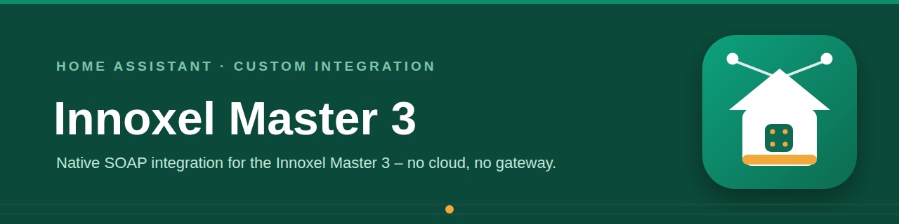

# Innoxel Master 3 — Home Assistant Integration

A native Home Assistant custom integration for the **Innoxel Master 3** home automation controller, talking directly to its SOAP API — no cloud, no MQTT bridge, no separate gateway.

> This is an independent, community-built integration. It is **not affiliated with or endorsed by Innoxel**, and does not use any Innoxel trademarks or branding.

## Why this exists

The Innoxel Master 3 only exposes a SOAP interface and has no official Home Assistant integration. This project talks to that SOAP API directly and maps your configured modules (covers, switches, dimmers, sensors, room climate, time switches) to native Home Assistant entities — automatically, based on how you've already named and described things in your Innoxel configuration. No YAML mapping, no manual entity setup.

Protocol details were informed by the community reference project [matthsc/innoxel-soap](https://github.com/matthsc/innoxel-soap) — credit to its author for documenting the SOAP interface.

## What it provides

| Platform | Source | Notes |
|---|---|---|
| `cover` | `masterOutModule` with `"Motor"` in the description | Full-travel movement via matching virtual `masterInModule` channel (`autoImpulse`) when found; otherwise falls back to a short output pulse. See [Cover behavior](#cover-behavior) below. |
| `cover` (Motor G2, **experimental**) | `masterBlindModule` | Blinds on INNOXEL Motor G2 modules with real position + slat-tilt feedback: set position, set tilt, stop. See [Motor G2 modules](#motor-g2-modules-experimental) below. |
| `switch` | `masterOutModule` with `"Switch"` or `"Virtuell"` in the description | Toggle-based |
| `switch` (time switch) | `masterTimeSwitchModule` | Enable/disable a schedule |
| `light` | `masterDimModule` | Brightness only |
| `sensor` (weather) | `masterWeatherModule` | Temperature (actual + felt), wind speed, sun brightness (east/south/west), twilight lux |
| `binary_sensor` (weather) | `masterWeatherModule` | Rain, civil twilight (dawn), sensor error |
| `binary_sensor` | `masterOutModule` — every `"In 8 / Out 8"` module at any index (their out channels are status LEDs), plus other output modules from index 45 on whose description contains neither `"Switch"` nor `"Virtuell"` | Physical output status, read-only |
| `climate` + `sensor` + `binary_sensor` | `masterRoomClimateModule` | Target/actual temperature, valve open state, firmware-reported heating/cooling action, thermostat alarm (diagnostic) |
| `number` | `masterRoomClimateModule` | Adjustable night-setback and absence-setback temperatures per room; optional cooling setpoint and cooling setbacks (enable via the integration options if your system actively cools) |
| `sensor` + `binary_sensor` (diagnostics) | `getDeviceStateList` | Master hardware health: supply/CPU/backup-battery/key-matrix voltages, CPU temperatures, uptime, serial error counters, CAN/Com bus supply states (as problem sensors). These entities become unavailable when the diagnostics read keeps failing, see [Polling](#polling) |
| `sensor` (diagnostics, "Diagnose Geräteinfo") | `getDeviceIdentityList` + `getDeviceVersionList` | Master identity, read once at startup: state is the location name (falls back to the model); attributes carry model, manufacturer, MAC address, UUID, location, installation details, firmware and hardware version |

**Note on the uptime sensor:** it reports the master's `statisticsTotalRunTime`, which counts operating time since the last complete power interruption (cold start). Warm restarts — e.g. a configuration upload from the INNOXEL Setup software — do **not** reset it, so it can show more days than the "runtime" visible in INNOXEL Setup after an upload. The SOAP protocol exposes no time-since-last-boot value.

All entity names, room labels, and channel descriptions are read live from your own Innoxel controller via SOAP `getIdentity` at startup — **nothing is hardcoded**. Whatever you've named your channels in the Innoxel configuration is what shows up in Home Assistant.

### Entity ids

Entity ids do not depend on your Home Assistant language. Home Assistant's entity registry generates every object id from the entity's name, which the integration builds from the module address plus the channel name in your Innoxel configuration (switches, covers, dimmers, output status, Motor G2 blinds) or from a fixed label (weather station, room climate, time switches, diagnostics). On a fresh installation: an OutModule switch channel named `Kitchen light` on module 1, channel 3 becomes `switch.o01_3_kitchen_light`; a cover pair becomes `cover.o02_k0_<name>` (the up channel's name without its ` auf` suffix); a dimmer channel becomes `light.d01_2_<name>`; a physical output status becomes `binary_sensor.o45_2_<name>`; a Motor G2 blind becomes `cover.b01_0_<name>`; room climate entities become `climate.raumklima_1`, `sensor.raumklima_1_ist_temp`, `sensor.raumklima_1_soll_temp` and `number.raumklima_1_nachtabsenkung`; weather and diagnostics entities become e.g. `sensor.wetterstation_temperatur`, `binary_sensor.wetterstation_regen`, `sensor.diagnose_uptime` and `binary_sensor.diagnose_can1_versorgung`; a time switch takes its name from the Innoxel configuration. The id is derived once, when the entity is first created: renaming a channel in INNOXEL Setup later updates the displayed name but keeps the id, and any entity can be renamed in its settings at any time.

Installations set up with version 1.5.x or older keep the ids they already have (`sensor.innoxel_weather_temperature`, `climate.innoxel_rc00`, `sensor.innoxel_diag_uptime_days`, `switch.innoxel_ts_0`, `cover.innoxel_b01_0`, ...): the entity registry owns them, and the unique ids they are keyed on have not changed. Entity names are unchanged as well.

## Options

The **Configure** dialog (**Settings → Devices & Services → Innoxel Master 3 → Configure**) shows the connection settings — IP address, port, username, password — pre-filled, so you can review or change them at any time after setup, e.g. after changing the Innoxel user's password or the master's IP address. Changes are verified against the device before being applied; the integration then reloads automatically.

If the master rejects the stored credentials (for example after the password was changed on the master first), the integration stops polling and Home Assistant shows a **Re-authenticate** prompt on the integration card. Enter the current username and password there — they are verified against the master, stored, and the integration reloads. Nothing else needs to be re-added.

Cooling controls (cooling setpoint, cooling night/absence setbacks) are **off by default**, since most Innoxel installations only heat. Enable them in the setup dialog or later via the same Configure dialog — the entities appear/disappear automatically.

## Cover behavior

Innoxel distinguishes two ways to drive a motorized cover:

- **Short button press (`autoImpulse` on a virtual InModule channel)** → full travel to the end position
- **Long press (`set`/`clear` on the OutModule channel)** → jog/wipe only while held

This integration always aims for full-travel behavior. On startup, it fuzzy-matches each cover's OutModule channel name (e.g. `"Living Room Blind auf"`) against your InModule channel names to find the matching virtual input pair. If a confident match is found, `open_cover`/`close_cover` trigger `autoImpulse` on that virtual input. If no match is found, it falls back to a brief `set` + `clear` pulse on the OutModule channel (**not** `toggle` — a `toggle` on a motor channel leaves the relay permanently engaged, since motor channels always report `outState="off"` regardless of actual relay state).

Pressing the same direction again while a cover is mid-travel sends a stop command (native Innoxel `autoImpulse` stop behavior). Cover state is always `unknown` — the SOAP API exposes neither a position nor real relay state for motor channels, and any assumed state would go stale as soon as the cover is moved by its wall switch, a scene or an automation. As a result, both the open and the close button stay enabled at all times.

**For a matching pair to be found, your OutModule and InModule channel names in the Innoxel configuration must correspond** — e.g. OutModule channel `"Kitchen Blind auf"` should have a same-named (or closely matching) pair of InModule channels.

### Motor G2 modules (experimental)

INNOXEL Motor 4 x 230 VAC G2 / Motor 4 x 24 VDC G2 modules (with INNOXEL Master 3 firmware 1.5.1.0 or newer) have a built-in position tracker, and the SOAP API exposes them as a separate `masterBlindModule` class. For each G2 blind channel the integration creates a cover entity with:

- **Real position and slat-tilt readback** (`current_cover_position`, `current_cover_tilt_position`; the raw 0–1000 values are exposed as `raw_position` / `raw_tilt` attributes, `-1` meaning the tracker position is currently unknown)
- **Set position / set tilt** — the blind drives to the requested position (`autoPositionAndTilt` command)
- **Stop** (`halt` command)

Discovery is tolerant: installations without G2 hardware (or with older firmware) simply get no such entities, nothing else changes.

**This feature is experimental.** It was implemented from the INNOXEL WebApp SOAP protocol without G2 hardware available for testing. In particular the position scale direction (raw `0` = fully open) is an assumption. If you own Motor G2 modules, feedback is very welcome — please [open an issue](https://github.com/prusuino/ha_innoxel_master3/issues) and mention whether position, tilt, and direction behave correctly.

## Installation

Requires Home Assistant **2025.2** or newer.

### HACS (recommended)

1. Open **HACS**, search for **"Innoxel Master 3"** and download it — or use the button, which opens the integration directly in your HACS:

   

2. Restart Home Assistant.

Until the integration shows up in the HACS search, the button above adds it as a custom repository.

### Manual

1. Copy the `custom_components/innoxel` folder into your Home Assistant `config/custom_components/` directory.
2. Restart Home Assistant.

## Setup

Home Assistant discovers an Innoxel Master 3 on your network automatically (SSDP) and suggests setting it up — the host and port come pre-filled, you only add the credentials. Manual setup works too:

1. Go to **Settings → Devices & Services → Add Integration**.
2. Search for **"Innoxel Master 3"**.
3. Enter:
   - **IP address** of your Innoxel Master 3
   - **Port** (default `5001`)
   - **Username** / **Password** — a user account configured on the Innoxel Master 3 itself. If you haven't created one yet, open the master's built-in web interface at `http://<innoxel-ip>:5001/maintenance/users.html` and add a user there — those are the credentials the integration needs. Authentication is HTTP Digest, handled automatically.
4. On success, all discovered entities are created immediately based on your existing Innoxel configuration.

All entities are attached to a single **INNOXEL Master 3** device. Its device page groups them into Controls / Sensors / Diagnostic sections and shows the model, firmware and hardware versions, MAC address, serial number and a link to the master's web interface.

## Polling

Two independent pollers talk to the master (`SCAN_INTERVAL` and `SLOW_SCAN_INTERVAL` in `const.py`):

- **Fast, every second:** output, dim and Motor G2 blind module state — switches, lights, covers and output status binary sensors. Fast enough for responsive UI feedback on physical button presses elsewhere in the house.
- **Slow, every 10 seconds:** weather station, time switches, room climate (one request per thermostat) and the hardware diagnostics (`getDeviceStateList`). The slow poll runs on its own schedule; the one-second poll never waits for it.

A failing diagnostics call never breaks the other updates: weather, time switch and room climate entities keep updating. The diagnostics entities themselves (voltages, CPU temperatures, uptime, serial errors, bus supply states) show the last successful reading for up to 60 seconds (six slow polls) and then become **unavailable** instead of presenting stale values; they come back with the next successful read.

The state poll also watches the master's `bootId`, which changes whenever the master loads a new configuration (e.g. an upload from the INNOXEL Setup software). When that happens, the integration reloads itself once automatically, so renamed, added, or removed channels show up in Home Assistant without a manual reload. Registry entries of deleted channels remain and can be removed by hand. While the master is unreachable, no reload is triggered — entities just become unavailable until it returns.

## Known limitations

- Room climate module discovery queries `getState` individually per module index (0–8) rather than via `getIdentity`, because `getIdentity` returns an HTTP 500 for `masterRoomClimateModule` on current firmware.
- The SOAP API does not report actual relay state for motor-driven cover channels — cover state is therefore always `unknown` (Motor G2 blinds excepted, which have real position feedback).

## Disclaimer

This integration is provided **as-is, without any warranty**. It controls real hardware — covers/blinds, lights, heating. Use it at your own risk. The author(s) accept **no responsibility or liability** for any damage, malfunction, incorrect behavior, data loss, or other issues arising from using this integration, whether it stops working, behaves unexpectedly, or never worked correctly for your setup in the first place. Test thoroughly in your own environment before relying on it for anything safety- or property-relevant.

## License

MIT — see [LICENSE](LICENSE). Not affiliated with Innoxel.

## Related integrations

More Home Assistant integrations from the same author:

- [Swiss Waters](https://github.com/prusuino/ha_swiss_waters) — live water temperature, water level, discharge and flood danger levels of Swiss rivers and lakes
- [Swiss Charging Stations](https://github.com/prusuino/ha_swiss_charging_stations) — real-time availability and prices of public EV charging stations in Switzerland
- [Austrian Charging Stations](https://github.com/prusuino/ha_austrian_charging_stations) — real-time availability of public EV charging stations in Austria
- [Swiss Transport](https://github.com/prusuino/ha_swiss_transport) — live public-transport departure boards and saved connections
- [Swiss Parking](https://github.com/prusuino/ha_swiss_parking) — live free parking spaces in Swiss cities
- [Swiss Electricity Price](https://github.com/prusuino/ha_swiss_electricity_price) — electricity tariffs of any Swiss grid operator (ElCom)
- [Swiss Solar Reference Price](https://github.com/prusuino/ha_swiss_solar_reference_price) — the Swiss solar reference market price (SFOE)
- [Swiss Earthquakes](https://github.com/prusuino/ha_swiss_earthquakes) — recent Swiss earthquakes on the built-in map
- [Swiss Public Alerts](https://github.com/prusuino/ha_swiss_public_alerts) — official Swiss public alerts (Alertswiss) with home-location matching
- [Swiss Avalanche Bulletin](https://github.com/prusuino/ha_swiss_avalanche_bulletin) — the official SLF avalanche bulletin for your location

## Support

If this integration is useful to you, you can support its development:

